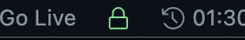

# chester README

A simple extension to signal your turn in any active Lichess game.
Adds a little pawn icon to the status bar at the bottom of the screen.

When it is your turn to play, the pawn will light up green and link you to
the active game.

This extension is ideal for slower or untimed forms of play. I play a lot of
correspondence chess while I code, and clicking into the browser tab to see
I had a turn to take was interrupting my workflow.

To those wondering, yes, it's *definitely* a pawn icon, no need to look at the source.

If the source code for this extension *does* interest you, it's available on
my github *here*.

## Setup

Just add your Lichess username in the extension settings, and configure the
other settings how you like. Your games on Lichess must be public.

## Features

### Refresh frequency

Change the refresh timing in the extension settings. You could have chester check every hour and a half, or every other second. Time is in milliseconds.

### Monochrome

If you prefer a tidier status bar or want to minimize visual distraction, the
monochrome option uses a separate icon set to tell you it's your turn to play.

## Extension Settings

This extension contributes the following settings:

* `chester.username`: user's Lichess username
* `chester.refreshTimer`: frequency with which chester fetches games
* `chester.monochrome`: use icons rather than color to alert user

## Known Issues

None. chester is perfect ok you're not really supposed to add custom colors
but i havn't figured out how I want to hook into themes yet.

## Release Notes

Users appreciate release notes as you update your extension.

### 1.0.0

Initial release of chester

-----------------------------------------------------------------------------------------------------------
